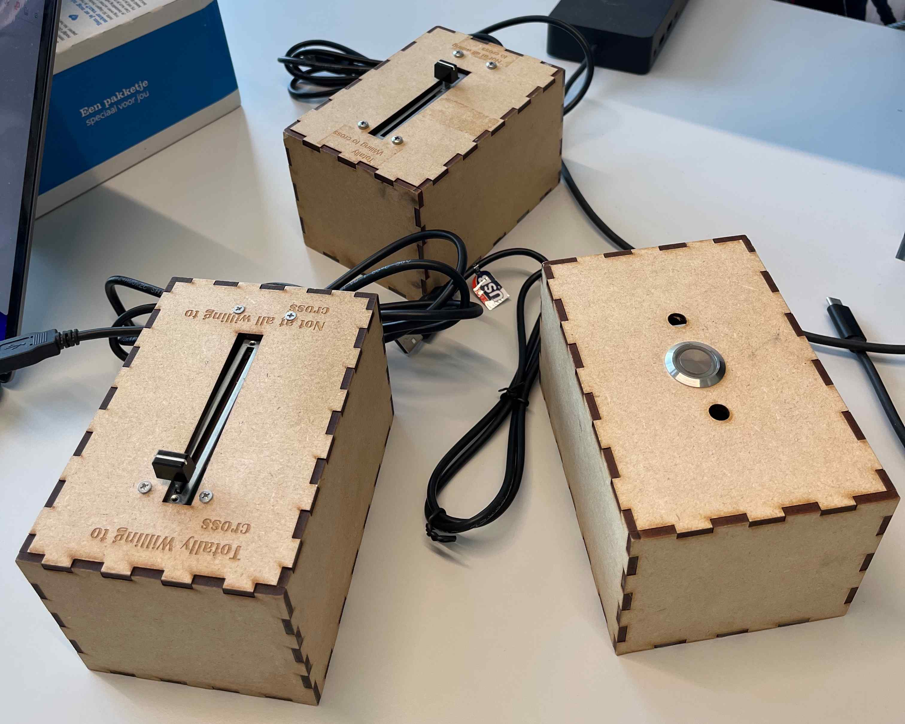
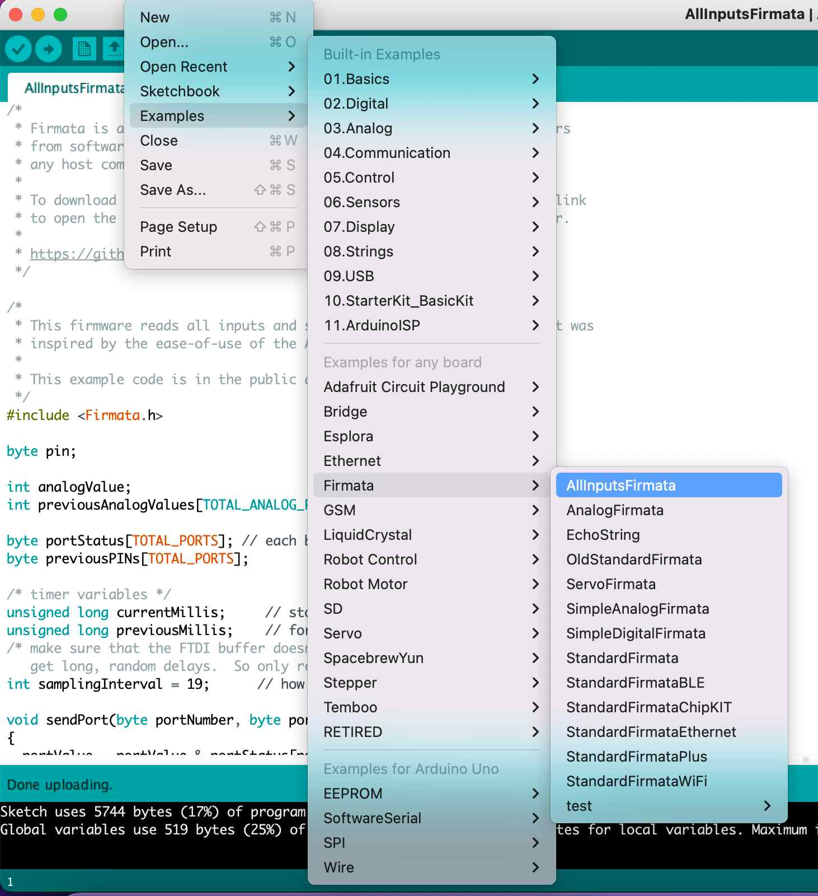

# Box for getting slider and push button input
🚀 Initial version of code by https://github.com/deydavedey.

## Both slider and push button boxes
Frequency: 10Hz

Data is stored in a folder `/data` as csv file.
To run:
1. Download with https://processing.org
2. Install libraries `controlP5`, `cc.arduino`

## Slider box
Range of slider 0-1023 (mapped to 1-100)

Code: `CrossBoxS.pde`

After connecting by USB, need to change serial port number by hand (`CrossBoxS:63`)

Pins in analogue read. Data pin (red) should be in `Digital 2`. The other ones in `5V` (blue) and `Ground` (orange).

Data: timestamp, raw value, mapped value

## Push button box
Probably 0 and 1

Code: `CrossBoxP.pde`

After connecting by USB, need to change serial port number by hand (`CrossBoxP:54`)

Pins go to `5V`, `Ground`, `A0`.

Data: timestamp, raw value (0/1)

## Synchronisation
Code: `CrossBoxBoth.pde`

Need to be connected to the same device.

Data: timestamp, raw value slider, mapped value slider, raw value button

Troubleshooting
1. Not working? - Check COM port mapping.
2. Not working? - Try `Firmata flush` in the Arduino IDE (as image below).

